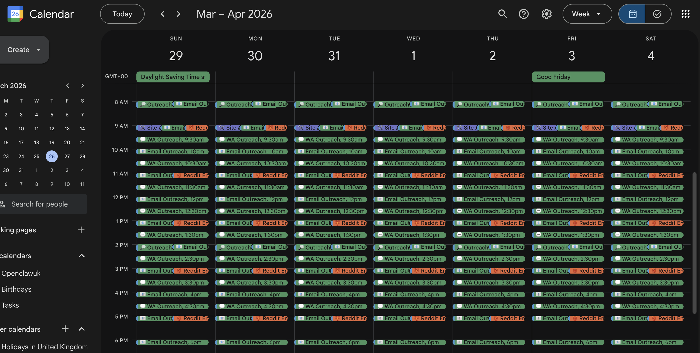
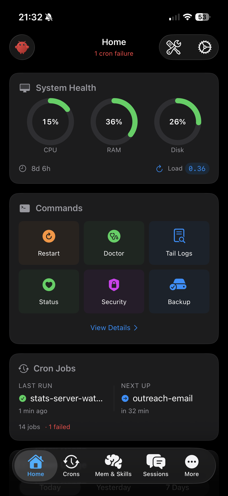
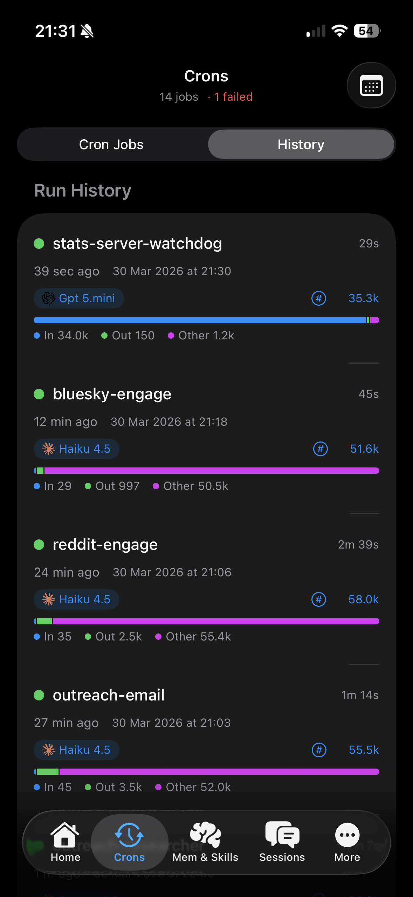
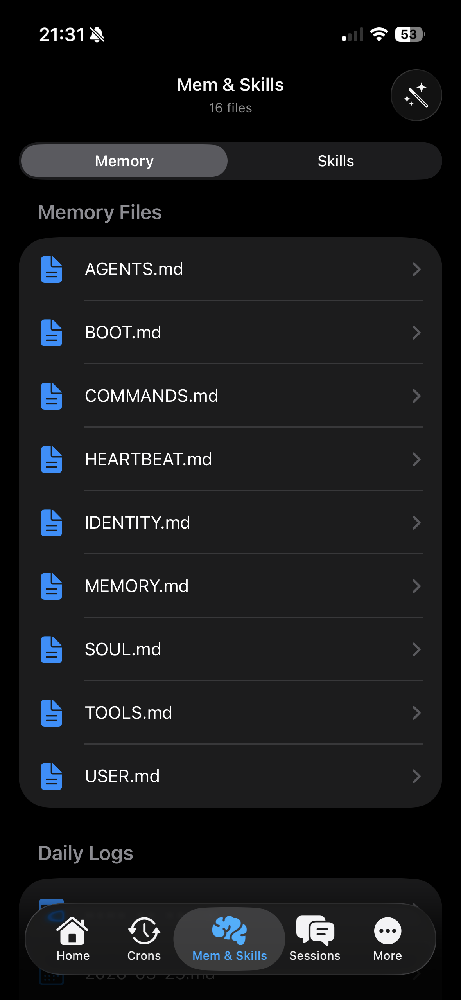
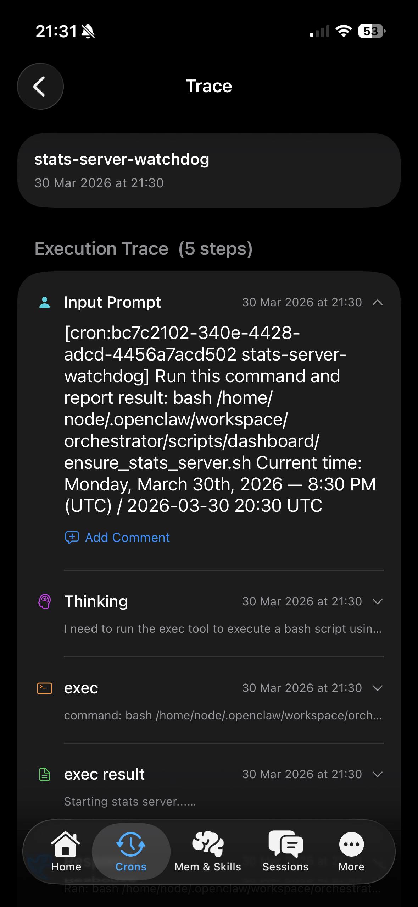
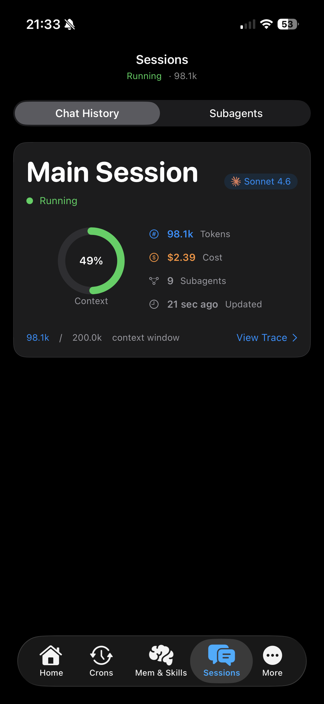
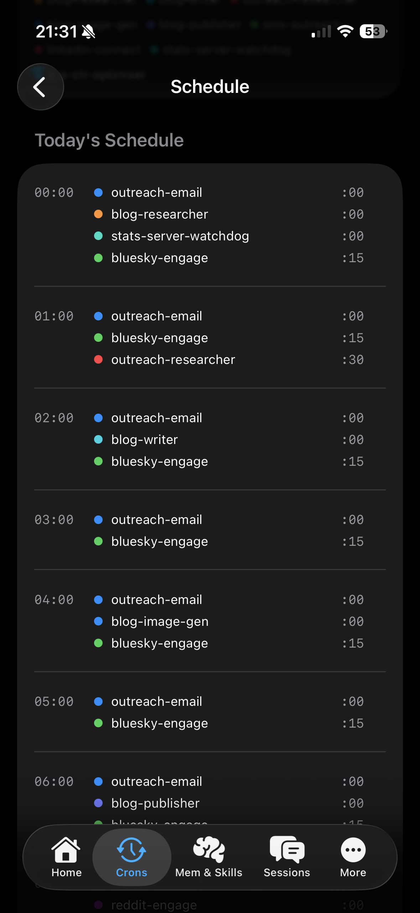
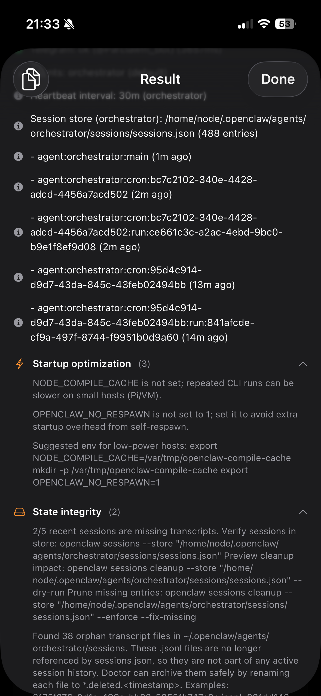

<p align="center">
  
</p>

<h1 align="center">OpenClaw for iOS</h1>

<p align="center">
  A native control room for the <a href="https://github.com/nichochar/openclaw">OpenClaw</a> AI gateway.<br>
  Monitor, trace, chat, and manage your agent — from your phone.
</p>

<p align="center">
  
  
  
  
  
  
</p>

---

## The Story

Hi, I'm **Parham** — Manchester-based software developer with 12+ years of experience. Technical Lead at [Kitman Labs](https://www.kitmanlabs.com) by day, OpenClaw and AI enthusiast by night.

I've been deep in AI for the last three years, and [OpenClaw](https://github.com/nichochar/openclaw) genuinely impressed me — it was the missing piece for automating my workflows and being dramatically more productive. Here's one of my earlier cron schedules in Google Calendar (it's much crazier now):

<p align="center">
  
</p>

But as a technical person myself, I found the onboarding, setup, and control UI wasn't OpenClaw's best feature. The engine, the brain, how it works — that's extraordinary. The UX? Not so much.

**Swift and iOS are my specialty**, so I built this. The main reasons:

- **Tracing** — cron runs get crazy in logs. Being able to drill down to any trace step and ask the agent to investigate a warning or error should be much easier than the web control UI
- **Comments on everything** — see a memory file that needs updating? Comment on a paragraph. See a trace step that looks wrong? Comment on it. The agent reads your comments and acts. This is the missing piece
- **Mobile-first control** — pull down to refresh, tap to investigate, chat with your agent while on the go

---

## Demo

<p align="center">
  <a href="resources/ScreenRecording_03-30-2026 14-22-00_1.MP4">
    
  </a>
</p>

<p align="center"><em>3-minute walkthrough of the app in action</em></p>

---

## Screenshots

<p align="center">
  
  
  
</p>

<p align="center">
  
  
  
</p>

<p align="center">
  
</p>

---

## Features

### Dashboard
Core cards: System Health (ring gauges, 15s polling), Commands (12 quick actions with parsed output + AI investigation), Cron Summary, Token Usage (charts, pipeline attribution). Optional cards (Outreach Stats, Blog Pipeline) appear automatically if the gateway provides those endpoints — hidden gracefully otherwise.

### Cron Management
Full job list with status badges. Segmented Cron Jobs / History. 24-hour schedule timeline. Detail view with: purpose, model, schedule, stats (avg duration, tokens, success rate), paginated run history. One-tap "Investigate with AI" on errors.

### Execution Traces
Step-by-step agent traces: system prompts, thinking, tool calls, tool results, responses. Metadata pills (model with provider icon, tokens). **Comment on any step** — queue comments, batch submit, agent investigates with full session context.

### Memory & Skills
Browse all workspace files. Paragraph-level markdown viewer with **Figma-style comments** — annotate paragraphs, submit to agent for edits. Skills: browse folder trees, read SKILL.md with comments, view scripts/config read-only. Skill-level comments instruct agent to read `create-skill` best practices first. Maintenance actions: Full Cleanup, Today Cleanup.

### Streaming Chat
SSE streaming chat with the orchestrator agent. Session-bound (server manages history). Chat bubbles with markdown, timestamps, copy. Auto-scroll, stop button, interactive keyboard dismiss.

### Sessions
Main session hero card with context window ring gauge. Subagent list. Both link to execution traces.

### Command Output Parsers
Custom parsed views for: **Tail Logs** (level-filtered structured entries), **Security Audit** (severity badges, collapsible findings with fixes), **Doctor** (collapsible sections, status lines), **Status** (table sections), **Channel Status** (probe cards). Raw monospace fallback for others.

### Admin
Models & Config (provider icons, fallbacks, aliases). Channels (status dots, provider usage bars). Tools & MCP (native tool groups, MCP server detail with lazy-loaded tool lists). All 15 exec commands.

---

## Getting Started

1. **Clone** this repo
2. **Open** `OpenClaw.xcodeproj` in Xcode 16+
3. **Build and run** on a simulator or device (iOS 17+)
4. **On first launch**, enter your gateway URL and Bearer token
5. The dashboard loads automatically — pull down to refresh

### Prerequisites

- An [OpenClaw](https://github.com/nichochar/openclaw) gateway running and accessible
- A Bearer token for authentication
- Gateway config:
  ```
  tools.sessions.visibility = "all"
  tools.profile = "full"
  gateway.http.endpoints.chatCompletions.enabled = true
  ```

---

## Architecture

Clean Architecture with MVVM per feature. 135 files, ~11,000 lines.

```
View → LoadableViewModel<T> → Repository protocol → GatewayClientProtocol → URLSession
                                      ↓
                                 MemoryCache (actor, TTL)
```

- **Swift 6** concurrency: `@Observable`, `@MainActor`, strict `Sendable`
- **Design system**: `Spacing`, `AppColors`, `AppTypography`, `AppRadius`, `Formatters`
- **Shared components**: `ModelPill`, `ProviderIcon`, `DetailTitleView`, `CommentSheet`, `CommentInputBar`, `CopyButton`, `ElapsedTimer`, `TokenBreakdownBar`
- **One external dependency**: [MarkdownUI](https://github.com/gonzalezreal/swift-markdown-ui)

See [CLAUDE.md](CLAUDE.md) for the full architecture guide, conventions, and API gotchas.

---

## API

All requests go to your configured gateway URL with `Authorization: Bearer <token>`.

| Method | Path | Purpose |
|--------|------|---------|
| GET | `/stats/system` | CPU, RAM, disk, uptime |
| GET | `/stats/tokens?period=` | Token usage with model breakdown |
| POST | `/stats/exec` | Run allowlisted commands |
| POST | `/tools/invoke` | Gateway tool calls (cron, sessions, memory) |
| POST | `/v1/chat/completions` | Chat streaming (SSE) + agent prompts |

<details>
<summary>Full command list</summary>

**Action commands**: `doctor`, `status`, `logs`, `security-audit`, `backup`, `channels-status`, `config-validate`, `memory-reindex`, `session-cleanup`, `plugin-update`

**Workspace commands**: `memory-list`, `skills-list`, `skill-files`, `skill-read`

**Admin commands**: `models-status`, `agents-list`, `channels-list`, `tools-list`, `mcp-list`, `mcp-tools`
</details>

---

## AI-Generated

100% of the code in this repository was generated by AI (Claude Code). Every file, every view, every parser — written through conversation, not by hand. The architecture, patterns, and conventions were designed collaboratively but the implementation is entirely AI-authored.

## Roadmap

If this project gets enough traction, the long-term plan is to migrate to **Kotlin Multiplatform (KMP)** for shared data and business logic layers, with native UI on each platform:

- **iOS** — SwiftUI (current)
- **Android** — Jetpack Compose
- **macOS** — SwiftUI (shared with iOS)
- **Shared** — Kotlin Multiplatform for networking, repositories, DTOs, and business logic

### Future: Semantic Memory Search

The `memory_search` tool is available via `/tools/invoke` but requires an embedding provider (OpenAI, Google, Voyage, or Mistral API key) to be configured on the server. Once enabled, semantic search can be added to the Memory tab.

## Contributing

Contributions are welcome. Please open an issue first to discuss what you'd like to change.

## License

MIT

---

<p align="center">
  Built with <a href="https://claude.ai/code">Claude Code</a> by <a href="https://github.com/parham-dev">Parham</a>
</p>
